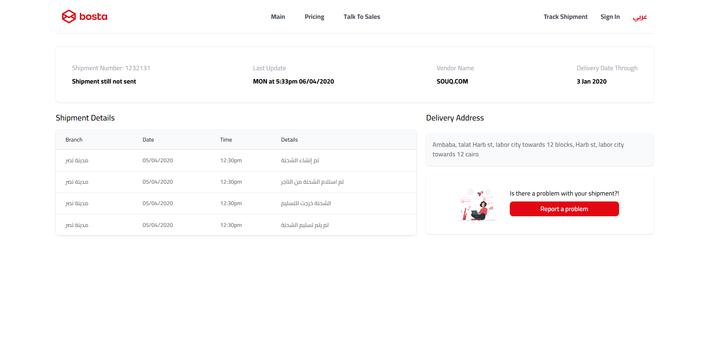
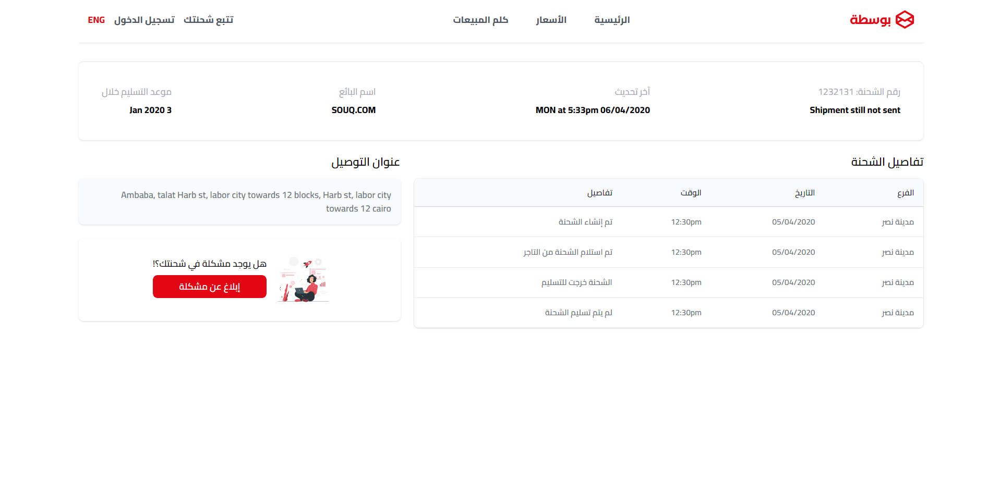

<br />
<div align="center">
  <h3 align="center">Bosta Task</h3>

  <p align="center">
   A simple clone to Bosta shipment Tracking page, built with Reactjs, TypeScirpt and Tailwind CSS
    <br />
    Utilizing public shipment tracking API, and handle the request in a Bosta UI.
    <br />
  </p>
</div>

  <details>
  <summary>Table of Contents</summary>
  <ol>
    <li>
      <a href="#about-the-project">About The Project</a>
      <ul>
        <li><a href="#built-with">Built With</a></li>
      </ul>
    </li>
    <li>
      <a href="#getting-started">Getting Started</a>
      <ul>
        <li><a href="#prerequisites">Prerequisites</a></li>
        <li><a href="#installation">Installation</a></li>
      </ul>
    </li>
    <li><a href="#contact">Contact</a></li>
  </ol>
</details>

## About The Project

English
[](https://github.com/0xramadan/bosta-task)

Arabic
[](https://github.com/0xramadan/bosta-task)

- Users can track their shipment by entering their shipment number
- Users can see new details about their shipment
- Built with React.js and Tailwind CSS.

### Built With


## Getting Started

### Prerequisites

- Node.js
- npm
- Bosta shipment tracking Api

### Installation

1. Clone the repo
   ```sh
   git clone https://github.com/0xRamadan/bosta-task.git
   ```
2. Install NPM packages
   ```sh
   npm i
   ```
3. Start the project
   ```sh
   npm run dev
   ```

## Contact

Mahmoud Ramadan - [Twitter](https://twitter.com/Mahmoudelalfy74) -
[Portfolio](https://0xramadan.vercel.app/) -
[LinkedIn](https://www.linkedin.com/in/0xramadan/)

Project Link: [Bosta Task](https://github.com/0xramadan/bosta-task)

Demo: [Bosta Task](https://bosta-task-seven.vercel.app/)
